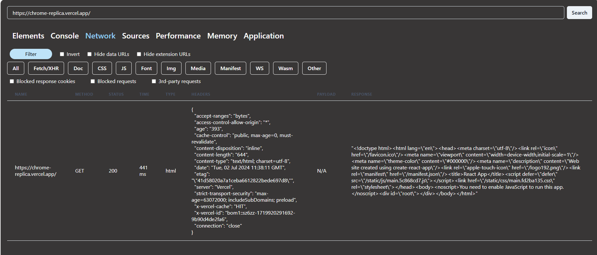

# Chrome-devtool clone
This project is a React application that allows users to fetch network request details from a specified URL and filter them based on different types of requests.

### Features
- Search Bar: Enter a URL and fetch network request details.
- Filtering: Filter network requests by type (fetch, xhr, css, js, etc.).
- Display: Display detailed information including method, URL, status, time, type, headers, payload, and response.

### Technologies Used
React | Redux | Chakra UI (for styling) | HTML | JS | axios | Express

### Deployment
link- 
video-